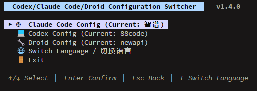
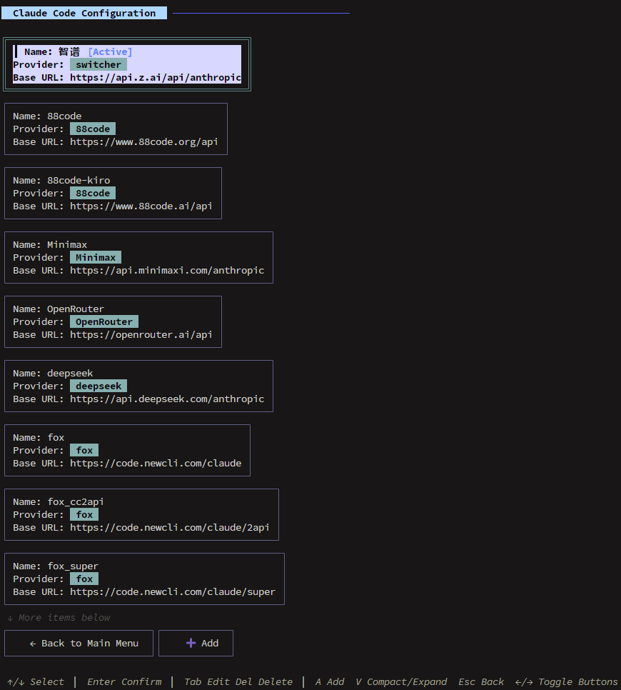
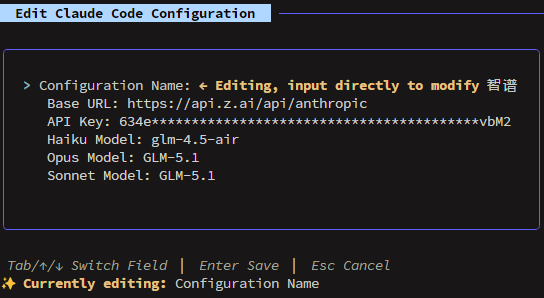

# 🔄 Switcher

<div align="center">


**English** | [中文](README_zh.md)

*A beautiful TUI-based CLI tool for managing and switching between Claude Code, Codex, and Droid configurations*

[](#-demo)
[](#-installation)
[](#-usage)

</div>

## ✨ Features

- 🎨 **Beautiful TUI** - Elegant terminal experience built with [Bubble Tea](https://github.com/charmbracelet/bubbletea)
- 🌐 **Bilingual Support** - Seamlessly switch between English and Chinese with 'L' key
- ⚡ **Quick Switching** - Instantly switch between different API configurations
- 🔒 **Secure Management** - API keys are masked in display for security
- 📝 **Configuration CRUD** - Easily add, edit, delete, and manage configurations
- 🎯 **Three Services** - Manage Claude Code, Codex, and Droid configurations simultaneously
- 💻 **CLI Mode** - Non-interactive command-line switching support
- 📂 **Auto Import** - Automatically imports existing configurations on first run
- 🔄 **Live Updates** - Changes are immediately applied to your configuration files

## 🎬 Demo

### Main Menu
<div align="center">


*Main menu with bilingual support - easily switch between services or change language*
</div>

### Configuration List
<div align="center">


*Browse and manage your configurations with active status indicators*
</div>

### Edit Configuration
<div align="center">


*Intuitive form interface with field-by-field editing and API key masking*
</div>

### Quick Commands

```bash
# Launch interactive TUI
switcher

# Or switch directly via CLI
switcher -switch-claude "OpenAI GPT-4"
switcher -switch-codex "Anthropic Claude"
switcher -switch-droid "Droid Model"
```

## 📦 Installation

### Linux / macOS

**From Source**

```bash
# Clone repository
git clone https://github.com/bingfengfeifei/switcher.git
cd switcher

# Build and install
make build
sudo make install
```

**Using Go**

```bash
# Direct install
go install github.com/bingfengfeifei/switcher@latest

# Or clone and build
git clone https://github.com/bingfengfeifei/switcher.git
cd switcher
go build -o switcher .
```

### Windows

**Using PowerShell**

```powershell
# Clone repository
git clone https://github.com/bingfengfeifei/switcher.git
cd switcher

# Build
.\build.ps1

# Build and install to system
.\build.ps1 -Install
```

**Using Go**

```powershell
# Direct install
go install github.com/bingfengfeifei/switcher@latest

# Or clone and build
git clone https://github.com/bingfengfeifei/switcher.git
cd switcher
go build -o switcher.exe .
```

## 🚀 Usage

### Interactive Mode (Default)

```bash
switcher
```

Navigate the beautiful TUI with:
- **↑/↓** or **j/k** - Navigate menu items
- **Enter** - Select/confirm action
- **Tab** - Switch between form fields
- **Esc** - Go back/exit
- **q** - Quit application

### Command-line Mode

```bash
# Switch Claude Code configuration
switcher -switch-claude "Configuration Name"

# Switch Codex configuration
switcher -switch-codex "Configuration Name"

# Switch Droid configuration
switcher -switch-droid "Configuration Name"
```

## 📁 File Locations

### Linux

| File | Location | Purpose |
|------|----------|---------|
| **Executable** | `/usr/bin/switcher` | System executable |
| **App Config** | `~/.config/switcher/config.json` | Stored configurations |
| **Claude Code** | `~/.claude/settings.json` | Claude Code settings |
| **Codex Auth** | `~/.codex/auth.json` | Codex authentication |
| **Codex Config** | `~/.codex/config.toml` | Codex configuration |
| **Droid Config** | `~/.factory/config.json` | Droid configuration |

### macOS

| File | Location | Purpose |
|------|----------|---------|
| **Executable** | `/usr/bin/switcher` | System executable |
| **App Config** | `~/Library/Application Support/switcher/config.json` | Stored configurations |
| **Claude Code** | `~/.claude/settings.json` | Claude Code settings |
| **Codex Auth** | `~/.codex/auth.json` | Codex authentication |
| **Codex Config** | `~/.codex/config.toml` | Codex configuration |
| **Droid Config** | `~/.factory/config.json` | Droid configuration |

### Windows

| File | Location | Purpose |
|------|----------|---------|
| **Executable** | `%LOCALAPPDATA%\Programs\switcher\switcher.exe` | System executable |
| **App Config** | `%APPDATA%\switcher\config.json` | Stored configurations |
| **Claude Code** | `%USERPROFILE%\.claude\settings.json` | Claude Code settings |
| **Codex Auth** | `%USERPROFILE%\.codex\auth.json` | Codex authentication |
| **Codex Config** | `%USERPROFILE%\.codex\config.toml` | Codex configuration |
| **Droid Config** | `%USERPROFILE%\.factory\config.json` | Droid configuration |

## 🛠️ Configuration Structure

Each service configuration contains:

```json
{
  "name": "My API Config",
  "provider": "openai",
  "base_url": "https://api.openai.com/v1",
  "api_key": "sk-..."
}
```

## 🎯 Supported Providers

- **OpenAI** - GPT models and API
- **Anthropic** - Claude models
- **Custom** - Any OpenAI-compatible API endpoint

## 🏗️ Architecture

```
switcher/
├── main.go            # Entry point and CLI arguments
├── tui/
│   ├── config.go      # Configuration management
│   ├── platform.go    # Cross-platform path abstraction
│   ├── shell.go       # Shell environment variable management
│   ├── controller.go  # Event handling and state machine
│   ├── menu.go        # State definitions and view routing
│   ├── init.go        # Model initialization
│   ├── style.go       # Styling and UI components
│   ├── util.go        # Utility functions
│   ├── claudecode.go  # Claude Code service component
│   ├── codex.go       # Codex service component
│   └── droid.go       # Droid service component
├── Makefile           # Build automation (Linux/macOS)
├── build.ps1          # Build script (Windows)
└── README.md          # This file
```

### Core Components

- **Configuration Engine** (`tui/config.go`) - Handles loading, saving, and applying configurations for Claude Code, Codex, and Droid
- **Platform Abstraction** (`tui/platform.go`) - Cross-platform path management for Linux, macOS, and Windows
- **Shell Manager** (`tui/shell.go`) - Cross-platform environment variable management (bash/zsh/fish/PowerShell)
- **TUI Controller** (`tui/controller.go`) - Central event handling, state transitions, and keyboard input processing
- **TUI Menu System** (`tui/menu.go`) - State management, model structure, and view routing
- **Service Components** (`tui/*code*.go`) - List views and specialized logic for each service
- **Style System** (`tui/style.go`) - Styling library using Lipgloss
- **CLI Interface** (`main.go`) - Command-line switching functionality and TUI initialization

## 🔧 Development

### Requirements

- Go 1.24.0 or higher
- Linux, macOS, or Windows operating system
- Make (optional, for Linux/macOS build automation)
- PowerShell (Windows build)

### Building

**Linux / macOS**

```bash
# Build binary
make build

# Build for all platforms
make build-all

# Install to system
sudo make install

# Clean build artifacts
make clean
```

**Windows**

```powershell
# Build binary
.\build.ps1

# Build and install
.\build.ps1 -Install
```

### Running Locally

```bash
# Run from source
go run .

# Or build and run
go build -o switcher .
./switcher
```

## 🎨 Customization

The TUI supports keyboard shortcuts for power users:

- **Vim-style navigation** with `j` and `k`
- **Quick actions** with single-key operations
- **Form navigation** with Tab between fields
- **Escape sequences** for intuitive navigation

## 🔒 Security

- API keys are **masked** in TUI display (`sk-****...`)
- Configuration files have **appropriate permissions**
- No API keys are logged or exposed in command output

## 🤝 Contributing

1. Fork the repository
2. Create your feature branch (`git checkout -b feature/amazing-feature`)
3. Commit your changes (`git commit -m 'Add some amazing feature'`)
4. Push to the branch (`git push origin feature/amazing-feature`)
5. Create a Pull Request

## 📄 License

This project is licensed under the Apache 2.0 License - see the [LICENSE](LICENSE) file for details.

## 🙏 Acknowledgments

- [Bubble Tea](https://github.com/charmbracelet/bubbletea) - Amazing TUI framework
- [Lipgloss](https://github.com/charmbracelet/lipgloss) - Beautiful styling library
- The excellent Go community ecosystem

## 📞 Support

If you encounter any issues or have feature requests:

- 🐛 [Report a Bug](https://github.com/bingfengfeifei/switcher/issues/new?template=bug_report.md)
- 💡 [Request a Feature](https://github.com/bingfengfeifei/switcher/issues/new?template=feature_request.md)
- 💬 [Start a Discussion](https://github.com/bingfengfeifei/switcher/discussions)

---

<div align="center">

**⭐ If this project helps you, please give it a star!**

Made with ❤️ by the open source community

</div>
